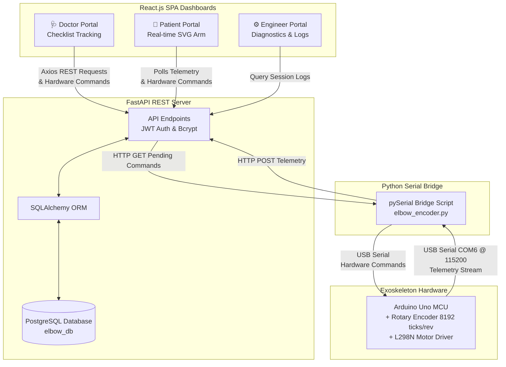

# 🦾 Smart Elbow Exoskeleton Rehabilitation Platform

**"An intelligent, clinical-grade IoT telemetry platform that analyzes kinematic telemetry to classify movement quality, detect abnormal rehabilitation sessions, and support adaptive therapy decisions."**

Built for researchers, clinicians, and engineers to collaborate on data-driven patient recovery, this project combines low-latency IoT hardware control with a robust React-based clinical dashboard and an advanced Machine Learning data pipeline.

---

## 1. High-Level Project Architecture




---

## 2. End-to-End Two-Way Data Flow

The platform pipeline is divided into the Telemetry (Upload) and Command (Download) flows:

### Telemetry Flow (Hardware -> Dashboard)
1. **Generation:** The patient moves their elbow. The high-resolution rotary encoder generates ticks (8192 per revolution).
2. **Microcontroller Ingestion:** The Arduino converts raw ticks into angle degrees and rotation direction, printing it to the serial line.
3. **Data Collector Ingestion:** The Python script [elbow_encoder.py](collector/elbow_encoder.py) reads this stream via `pySerial` at 115200 baud, logs raw backup data to local CSV files, and sends an HTTP POST payload to the backend's `/data/` endpoint.
4. **API & DB Save:** The FastAPI backend receives the JSON payload and saves it to the PostgreSQL `elbow_data` table.
5. **Real-time Display:** Both Doctor and Patient React Dashboards display the data using Live Recharts Line Graphs and SVG Skeletal Arm animations.

### Hardware Control Flow (Dashboard -> Hardware)
1. **Doctor/Patient Command:** A user clicks "Set Target Angle", "Zero Sensor", or "Emergency Stop" on the React Dashboard.
2. **PostgreSQL Queue:** FastAPI saves the command into the `commands` SQL table with a status of `pending`.
3. **Python Bridge Polling:** A background thread in `elbow_encoder.py` polls `GET /commands/pending` every 1 second.
4. **Serial Execution:** The Python script downloads the pending command, marks it as `executed` via `PUT /commands/{id}/execute`, and translates it into a byte string (e.g., `t90.0\n`, `s\n`, `c\n`) sent down the USB cable to the Arduino.
5. **Hardware Response:** The Arduino parses the byte string and engages the L298N motor driver using dynamic macro-PWM logic to reach the target angle.

---

## 3. Data Engineering & ML Telemetry Pipeline

Unlike raw IoT projects, this platform is designed specifically to generate high-variance, clinically relevant Machine Learning datasets for anomaly detection and physical therapy scoring.

### Telemetry Schema
The Python ingestion script (`elbow_encoder.py`) parses the raw serial string and writes structured time-series data directly to local CSVs and PostgreSQL:
`id, session_name, timestamp, target_angle, current_angle, error, motor_status`

> **Note:** The `motor_status` column captures the precise Macro-PWM pulse timing of the motor (ON vs Coast vs Stopped). This serves as a highly predictive feature for mechanical stalling, separating intentional rest from hardware failure.

### Data Collection Strategy
To prevent model overfitting, data is collected across distinct, isolated sessions covering multiple operational classes:
- **Normal Dynamics:** Short/long movements, stepping, and holding.
- **Simulated Anomalies:** 
  - **Frozen Joint / Mechanical Jam:** Motor pulses actively, but encoder remains flat.
  - **Patient Resistance:** Motor pulses actively, but movement is heavily constrained.
  - **Emergency Stops:** Sudden velocity drops triggered via software interrupt.

### Feature Extraction Pipeline
Raw time-series rows are converted into robust rolling windows to extract physics-based features, providing the ML models with true mechanical context:
- `Mean Error`, `Max Error`, `Velocity`, `Acceleration`, `Error Variance`, `Overshoot`, `Settling Time`

---

## 4. Machine Learning Roadmap

The platform's data strategy directly supports a 4-Stage Machine Learning pipeline to transform raw kinematics into adaptive therapy recommendations:

* **Stage 1: Movement Classification (RandomForest / XGBoost)**
  - Classifies the current movement type (e.g., Short Step, Long Swing, Hold, Jam, Resistance).
* **Stage 2: Anomaly Detection (Isolation Forest)**
  - Trained exclusively on normal telemetry to mathematically isolate and flag dangerous deviations (e.g., motor jamming or sudden patient resistance) acting as a proactive, sub-millisecond safety layer.
* **Stage 3: Movement Quality Scoring (Regression)**
  - Grades the patient's exercise execution on a 0-100 scale based on smoothness, overshoot, and velocity profiles.
* **Stage 4: Adaptive Therapy Recommendation Engine**
  - Uses the Quality Score to prescribe the next clinical action (e.g., "Increase Range of Motion", "Maintain", or "Decrease Difficulty").

---

## 5. Explaining Key Files by Folder

### 📂 Backend (FastAPI Server)
* **[main.py](backend/main.py):** The API entry point. Initializes database tables, sets up CORS middleware, and registers routers.
* **[database.py](backend/database.py):** Contains the SQLAlchemy configuration and PostgreSQL connection.
* **models directory:** Defines database tables (Users, Exercises, Prescriptions, Sessions, Telemetry).
* **routers directory:** Defines API endpoints for authentication, commands, and clinical data.
* **services directory:** Handles core logic (e.g., bcrypt password hashing and JWT token generation).

### 📂 Ingestion Collector (Python IoT Script)
* **[elbow_encoder.py](collector/elbow_encoder.py):**
  - Connects to the Arduino via `pySerial`.
  - Runs an infinite loop reading the port, logging raw CSV data, and pushing structured data to the backend.

### 📂 Frontend (React TypeScript)
* **[AuthContext.tsx](frontend/src/context/AuthContext.tsx):** Manages global authentication state and role-based access control.
* **[DoctorDashboard.tsx](frontend/src/pages/Doctor/DoctorDashboard.tsx):** Fetches patients and their prescriptions, allowing doctors to create new routines.
* **[PatientDashboard.tsx](frontend/src/pages/Patient/PatientDashboard.tsx):** Displays an interactive SVG joint visualizer drawing a 2D arm model dynamically using real-time serial feed trigonometry.

---

## 6. Quick Start

### 1. Install Dependencies
```bash
# Python dependencies
pip install fastapi uvicorn sqlalchemy psycopg2 requests pyserial python-dotenv PyJWT bcrypt pandas plotly streamlit

# React frontend dependencies
cd frontend
npm install
```

### 2. Seed Database
Reset your PostgreSQL tables and seed default users, templates, and prescriptions:
```bash
venv\Scripts\python.exe -m backend.seed
```

### 3. Start the Platform
* **FastAPI Backend:** `venv\Scripts\python.exe -m uvicorn backend.main:app --port 8001`
* **React Frontend:** `cd frontend && npm start`

---

## 7. Dashboard Roles & Logins

| Role | Username | Password | Key Features |
| :--- | :--- | :--- | :--- |
| **Doctor** | `doctor` | `password` | Searchable patient list, clinical notes, exercise prescription dropdown, exercise template creator. |
| **Patient** | `patient` | `password` | Prescribed routines, target metrics, interactive SVG arm joint simulator, dual-mode selector. |
| **Engineer** | `engineer` | `password` | Hardware connection stats, database logs list, raw telemetry diagnostics table. |

---

## 8. Exoskeleton Wiring & Serial Protocol

### Hardware Setup
* **Rotary Encoder (8192 ticks/revolution):** Phase A $\rightarrow$ D2 (Interrupt), Phase B $\rightarrow$ D3
* **Motor Driver (L298N):** ENA/ENB $\rightarrow$ D5, D6 (PWM), IN1-IN4 $\rightarrow$ D8-11
* **Arduino Uno:** Streams serial data over USB (identified on `COM6`).

### Serial Protocol (Two-Way)
* **Arduino $\rightarrow$ Python Bridge (100 Hz Telemetry):** `Target: 90.0 | Current: 45.0 | Error: 45.0 | ⚡ ON (Pulse)`
* **Python Bridge $\rightarrow$ Arduino (Commands):** `t90.0\n` (Set Target), `s\n` (Stop), `c\n` (Calibrate)