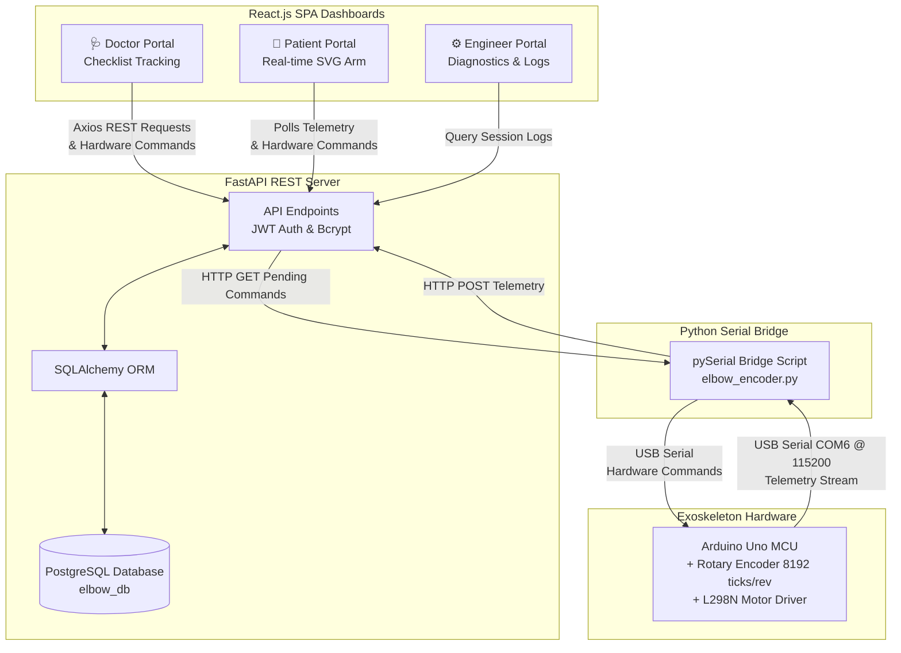

# 🦾 Smart Elbow Exoskeleton Rehabilitation Platform

An intelligent, clinical-grade IoT telemetry platform designed for physical therapy tracking, exercise prescription, and real-time kinematic visual feedback. Built for researchers, clinicians, and engineers to collaborate on data-driven patient recovery.

---

## 1. High-Level Project Architecture




---

## 2. End-to-End Two-Way Data Flow

To explain the project clearly, the pipeline is divided into the Telemetry (Upload) and Command (Download) flows:

### Telemetry Flow (Hardware -> Dashboard)
1. **Generation:** The patient moves their elbow. The high-resolution rotary encoder generates ticks (8192 per revolution).
2. **Microcontroller Ingestion:** The Arduino converts raw ticks into angle degrees and rotation direction, printing it to the serial line.
3. **Data Collector Ingestion:** The Python script [elbow_encoder.py](collector/elbow_encoder.py) reads this stream via `pySerial` at 115200 baud, logs raw backup data to local CSV files, and sends an HTTP POST payload to the backend's `/data/` endpoint.
4. **API & DB Save:** The FastAPI backend receives the JSON payload and saves it to the PostgreSQL `elbow_data` table.
5. **Real-time Display:** Both Doctor and Patient React Dashboards display the data using Live Recharts Line Graphs and SVG Skeletal Arm animations.

### Hardware Control Flow (Dashboard -> Hardware)
1. **Doctor/Patient Command:** A user clicks "Set Target Angle", "Zero Sensor", or "Emergency Stop" on the React Dashboard.
2. **PostgreSQL Queue:** FastAPI saves the command into the `commands` SQL table with a status of `pending`.
3. **Python Bridge Polling:** A background thread in `elbow_encoder.py` polls `GET /commands/pending` every 1 second.
4. **Serial Execution:** The Python script downloads the pending command, marks it as `executed` via `PUT /commands/{id}/execute`, and translates it into a byte string (e.g., `t90.0\n`, `s\n`, `c\n`) sent down the USB cable to the Arduino.
5. **Hardware Response:** The Arduino parses the byte string, disables interrupts if necessary (for calibration), and engages the L298N motor driver using dynamic macro-PWM logic to reach the target angle.

---

## 3. Explaining Key Files by Folder

### 📂 Backend (FastAPI Server)
* **[main.py](backend/main.py):** The API entry point. Initializes database tables, sets up CORS middleware, and registers the routers.
* **[database.py](backend/database.py) / [database/connection.py](backend/database/connection.py):** Contains the SQLAlchemy configuration. Creates the database engine, defines `SessionLocal` to handle transactions, and exports `get_db()` as a dependency resolver.
* **models directory:** Defines database tables as Python classes:
  - `User`: Handles accounts (username, hashed password, role: doctor/patient/engineer).
  - `Exercise`: Contains exercise templates (name, mode: position/force/torque, target angle).
  - `PatientExercise` (Prescription): Intermediary table mapping Exercises to Patients, including status and completion percentage.
  - `PatientSession`: Grouping of telemetry points for a single physical workout.
  - `ElbowData`: Telemetry records (ticks count, angle, rotations, timestamp).
  - `CommandQueue`: Two-way persistent audit log for hardware commands (Target Angle, Stop, Zero Sensor).
* **schemas directory:** Pydantic models used to validate request payloads (inputs) and serialize database responses (outputs). Separates concerns (e.g. `UserCreate` has a password, while `UserResponse` excludes it for security).
* **routers directory:** Defines API endpoints:
  - `/auth/login`: Verifies user password hash against database and returns a signed JWT access token.
  - `/exercises/`: Enables doctors to define new routines (`POST`) and assign/prescribe them (`POST /prescriptions`).
  - `/users/patients`: Returns all patients (restricted to doctors and engineers).
  - `/commands/`: Exposes hardware queue endpoints for the UI to submit commands and the Python bridge to poll them.
* **services directory:** Handles core logic:
  - `auth.py`: Uses `bcrypt` for secure, salted password hashing and `PyJWT` to generate stateless JWT tokens.

### 📂 Ingestion Collector (Python IoT Script)
* **[elbow_encoder.py](collector/elbow_encoder.py):**
  - Connects to the Arduino via `serial.Serial('COM6', 115200)`.
  - Prompts for Patient ID, registers a new session on the backend (`POST /sessions/`), and obtains a `session_id`.
  - Runs an infinite loop reading the port. Parses comma-separated payloads, writes a local raw CSV backup, and pushes structured data to `/data/` in a separate thread.

### 📂 Frontend (React TypeScript)
* **[AuthContext.tsx](frontend/src/context/AuthContext.tsx):** A React Context hook. It manages global authentication state (login status and user role) and keeps credentials persisted in `localStorage` across page refreshes.
* **[App.tsx](frontend/src/App.tsx):** Sets up routing using `react-router-dom`. Features a `<ProtectedRoute>` wrapper that redirects unauthenticated users to `/login` and blocks patients from accessing the doctor or engineer portals.
* **[DoctorDashboard.tsx](frontend/src/pages/Doctor/DoctorDashboard.tsx):**
  - Displays the active doctor's name as "Dr. John Doe".
  - Fetches patients and their prescriptions checklist dynamically using Axios.
  - Features forms to create predefined template routines and prescribe them to patients.
* **[PatientDashboard.tsx](frontend/src/pages/Patient/PatientDashboard.tsx):**
  - Displays assigned exercises and targets (mode, target angle, duration).
  - **SVG joint visualizer:** Draws a 2D arm model dynamically using trigonometry:
    $$\text{armX} = 120 + 80 \times \cos(\theta), \quad \text{armY} = 100 - 80 \times \sin(\theta)$$
  - Offers dual mode selection (Simulator mode with Auto-Sweep vs. Exoskeleton Live Serial Feed mode polling real-time PostgreSQL database).

---

## 4. Quick Start

### 1. Install Dependencies
Make sure you have your virtual environment activated:
```bash
# Python dependencies
pip install fastapi uvicorn sqlalchemy psycopg2 requests pyserial python-dotenv PyJWT bcrypt pandas plotly streamlit

# React frontend dependencies
cd frontend
npm install
```

### 2. Seed Database
Reset your PostgreSQL tables and seed default users, templates, and prescriptions:
```bash
venv\Scripts\python.exe -m backend.seed
```

### 3. Start the Platform

* **FastAPI Backend:**
  ```bash
  venv\Scripts\python.exe -m uvicorn backend.main:app --port 8001
  ```
* **React Frontend:**
  ```bash
  cd frontend
  npm start
  ```
* **Streamlit Dashboard (Optional Fallback):**
  ```bash
  venv\Scripts\python.exe -m streamlit run dashboard.py
  ```

---

## 5. Dashboard Roles & Logins

The login screen contains a role quick-selector that pre-populates these default accounts:

| Role | Username | Password | Key Features |
| :--- | :--- | :--- | :--- |
| **Doctor** | `doctor` | `password` | Searchable patient list, clinical notes, exercise prescription dropdown, exercise template creator. No option to delete prescriptions. |
| **Patient** | `patient` | `password` | Prescribed routines, target metrics, interactive SVG arm joint simulator, dual-mode selector (Simulator/Exoskeleton COM6). |
| **Engineer** | `engineer` | `password` | Hardware connection stats (COM6 status, baud rate), database logs list, raw telemetry diagnostics table. |

---

## 6. Exoskeleton Wiring & Serial Protocol

### Hardware Setup
* **Rotary Encoder (8192 ticks/revolution):**
  - VCC $\rightarrow$ 5V, GND $\rightarrow$ GND
  - Phase A $\rightarrow$ Digital Pin 2 (Interrupt-driven)
  - Phase B $\rightarrow$ Digital Pin 3
* **Motor Driver (L298N):**
  - ENA/ENB $\rightarrow$ Digital Pins 5, 6 (PWM)
  - IN1-IN4 $\rightarrow$ Digital Pins 8-11
* **Arduino Uno:** Streams serial data over USB (identified on `COM6`).

### Serial Protocol (Two-Way)
* **Arduino $\rightarrow$ Python Bridge (100 Hz Telemetry):**
  `count,angle_degrees,rotations`
  *(Example payload: `19192,123.40,2`)*
* **Python Bridge $\rightarrow$ Arduino (Hardware Commands):**
  - `t{float}\n` $\rightarrow$ Set Target Angle (e.g. `t90.0\n`)
  - `s\n` $\rightarrow$ Emergency Stop Motor
  - `c\n` $\rightarrow$ Zero Calibration (Reset Encoder count)
* **Python Bridge $\rightarrow$ FastAPI Endpoint (`POST /data/`):**
  ```json
  {
    "session_id": 4,
    "count": 19192,
    "angle_degrees": 123.4,
    "rotations": 2,
    "raw_data": "19192,123.40,2"
  }
  ```

---

## 7. Future Work & AI Expansion

* **FFT Tremor Analysis:** Apply Fast Fourier Transform (FFT) on incoming joint angle frequencies to identify muscle tremors (3–8 Hz bands) during range of motion exercises.
* **Surface EMG Integration:** Combine muscle activity tracking (e.g. AD8232 or Myoware EMG sensors) to compare motor effort against joint movement degrees.
* **Assist-as-Needed Control:** Integrate a motor driver (e.g. L298N H-Bridge) to adjust active torque parameters dynamically based on muscle fatigue.
* **Predictive Recovery Scoring:** Use Machine Learning regression models to compute a recovery outcome trajectory score based on historical exercise progress.

---

## 8. systemd Service Configuration
To deploy the backend on a Linux system or server, save the following as `/etc/systemd/system/elbow_backend.service`:

```ini
[Unit]
Description=Smart Elbow Exoskeleton FastAPI Backend
After=network.target

[Service]
User=pi
WorkingDirectory=/home/pi/smart-elbow-exoskeleton/backend
ExecStart=/home/pi/smart-elbow-exoskeleton/venv/bin/uvicorn main:app --host 0.0.0.0 --port 8001
Restart=always
RestartSec=5

[Install]
WantedBy=multi-user.target
```
Enable the service using: `sudo systemctl enable --now elbow_backend`